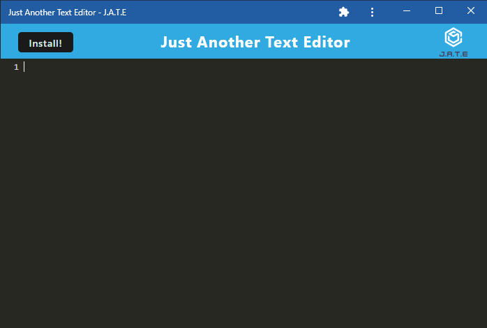

# Just Another Text Editor

[](https://opensource.org/licenses/MIT)

## **Description**
The purpose of this project was to create a text editor that runs in the browser. Users may also choose to install the application so that it may function offline.

## **Deployed Link**
Click on the following link to be navigated to the application: https://floating-tundra-37036.herokuapp.com/

## **Technologies**

* 
* 
* 
* 
* 
* 

## **Installation**
First, you'll want to clone down this repository onto your local machine. You can do this by copying the code within the green code button towards the upper-righthand side of the screen and typing out `git clone *insert your copied code here*` within your command terminal.

Next, you'll want to type the following in the command line. This installs the dependencies that will be used. 
```
npm install
```

Next, you'll want to run the following in the command line.
```
npm run start:dev
```

## **Usage**
In order to run the application, simply click on the deployed link. This will open the app in the browser. Then you can choose to install the text editor so that you may use it offline. 

## **Application**
Here is how the application looks like:



## **License**
The following application is covered under the MIT License.